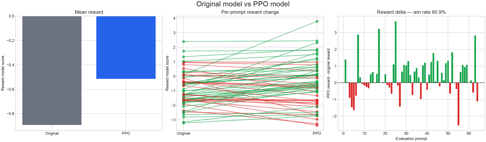
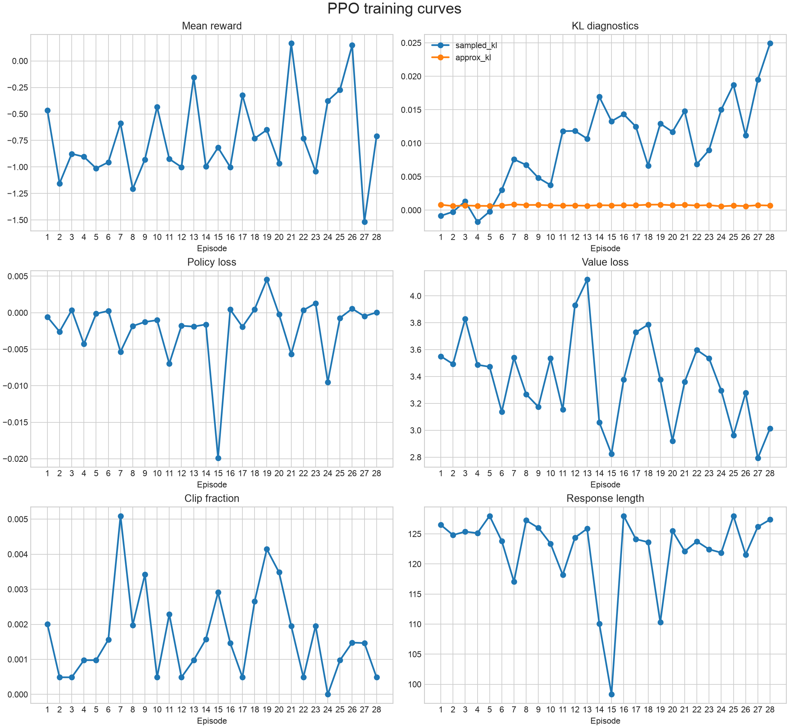

# PPO-RLHF 最终实验报告

实验日期：2026-08-29

## 1. 实验目的

验证本项目自行实现的 PPO-RLHF 流程能否：

1. 在单张 24GB GPU 上稳定完成训练；
2. 避免 Actor 远离初始模型后发生策略崩坏；
3. 在未参与训练和 checkpoint 选择的测试集上，提高 Reward Model 给出的偏好分数。

## 2. 实验环境

| 项目 | 配置 |
| --- | --- |
| Python | 3.11.15 |
| PyTorch | 2.12.1+cu130 |
| Transformers | 4.57.6 |
| Datasets | 5.0.1 |
| Matplotlib | 3.11.1 |
| Actor / Reference | Qwen/Qwen3-0.6B |
| Reward Model | OpenAssistant/reward-model-deberta-v3-large-v2 |
| GPU | 单张 NVIDIA RTX 4090 24GB |
| 实际运行时间 | 约 35 分 36 秒 |

服务器有两张 RTX 4090，但本实验固定使用 GPU 0；GPU 1 上存在其他任务，未参与本实验。

## 3. 数据划分与训练协议

从 shuffle 后的 512 条 WebGPT prompts 中进行固定划分：

| 数据 | 数量 | 用途 |
| --- | ---: | --- |
| Train | 384 | rollout 与 PPO 参数更新 |
| Validation | 64 | 每 4 轮评估并选择最佳 checkpoint |
| Test | 64 | 训练结束后仅评估一次 |

主要超参数：

| 参数 | 数值 |
| --- | ---: |
| Rollout prompts / episode | 8 |
| Samples / prompt | 2 |
| PPO epochs | 1 |
| Actor learning rate | 1e-6 |
| Critic learning rate | 1e-5 |
| Initial KL coefficient | 0.1 |
| Reference KL target / safety limit | 0.03 / 0.08 |
| Max prompt / response length | 192 / 128 |
| Validation interval | 4 episodes |
| Early-stopping patience | 4 checks |

## 4. 稳定性设计

Actor 使用 FP32 主权重和 optimizer state，计算使用 BF16 autocast。rollout 阶段按 2 条序列分批计算 Actor 与 Reference 的完整词表 logits，解决了早期版本在第 3 轮出现的显存溢出。

训练同时监控两种 KL：

- `approx_kl` 控制一次 PPO update 相对旧策略的局部变化；
- `sampled_kl` 监控 Actor 相对冻结 Reference 的累计漂移。

最终模型按验证集 Reward 选择，而不是使用最后一轮参数。该设计用于阻止后期 reward collapse 被写入最终 checkpoint。

## 5. 验证集选模结果

Reference 在验证集上的平均 Reward 为 `-0.6468`。

| Episode | Actor Reward | 当时最佳 Reward | 结论 |
| ---: | ---: | ---: | --- |
| 4 | -0.7360 | -0.6468 | 未超过基线 |
| 8 | -0.5686 | -0.5686 | 新最佳 |
| 12 | **-0.5256** | **-0.5256** | 最终最佳 |
| 16 | -0.7327 | -0.5256 | 退化 |
| 20 | -0.7693 | -0.5256 | 退化 |
| 24 | -0.7083 | -0.5256 | 退化 |
| 28 | -0.7345 | -0.5256 | 退化并触发早停 |

训练在第 28 轮停止，并恢复第 12 轮 Actor。

## 6. 独立测试集结果

| 指标 | 结果 |
| --- | ---: |
| 原模型平均 Reward | -0.8938 |
| PPO 平均 Reward | **-0.5150** |
| 平均 Reward 提升 | **+0.3787** |
| Reward 提升中位数 | **+0.3181** |
| 胜 / 平 / 负 | **39 / 1 / 24** |
| PPO 胜率 | **60.9%** |
| 提升标准误 | 0.1409 |
| 近似 95% 置信区间 | **[+0.103, +0.655]** |

置信区间整体高于 0，说明在本次 64 条测试样本上观察到的平均提升不太可能完全由随机波动或少数极端样本造成。

## 7. 训练行为

最终运行的 Reference sampled KL 始终低于 `0.025`，没有接近 `0.08` 的安全上限；局部 `approx_kl` 约为 `0.0006–0.0008`，clip fraction 很低，说明单次更新较温和。

验证结果显示模型在第 12 轮达到最佳点，之后虽然训练仍能运行，但泛化 Reward 开始下降。早停与最佳 checkpoint 恢复正确阻止了退化模型成为最终产物。

## 8. 定性观察

Reward 提升最大的测试问题包括：

- 远距离航天器如何向 NASA 传输图像；
- 英国为何没有采用欧元；
- 辐射环境为何导致电子设备失效；
- 橡皮为什么无法完全擦除铅笔痕迹。

仍然存在明显退步的问题，包括 MacBook 游戏性能、Y2K、跨国农产品和邮寄回信地址等。说明当前 PPO 模型并没有在所有知识领域稳定提升，Reward Model 也不能替代人工事实性评估。

## 9. 结论

本实验完成了三个目标：训练流程在单卡上稳定结束；验证集成功识别并恢复第 12 轮最佳模型；恢复后的模型在独立测试集上获得 `+0.3787` 的平均 Reward 提升和 `60.9%` 胜率。

因此当前实现已经超过“只能跑通的 demo”：它展示了可复现的 PPO 更新、策略稳定机制和独立测试集正向结果。但由于测试规模较小、评估依赖单一 Reward Model，仍应将其视为教学与研究原型，而不是生产级 RLHF 系统。
